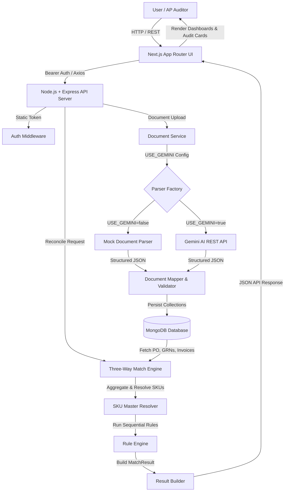
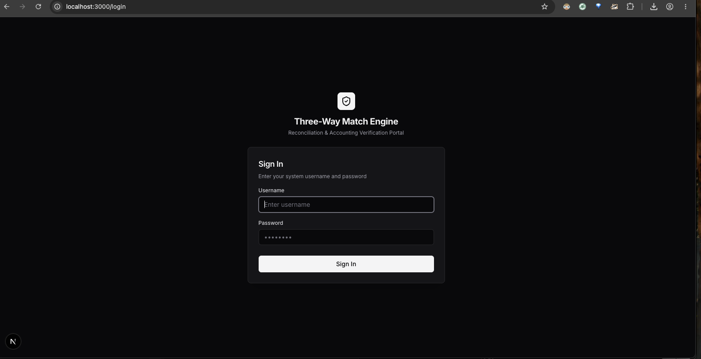
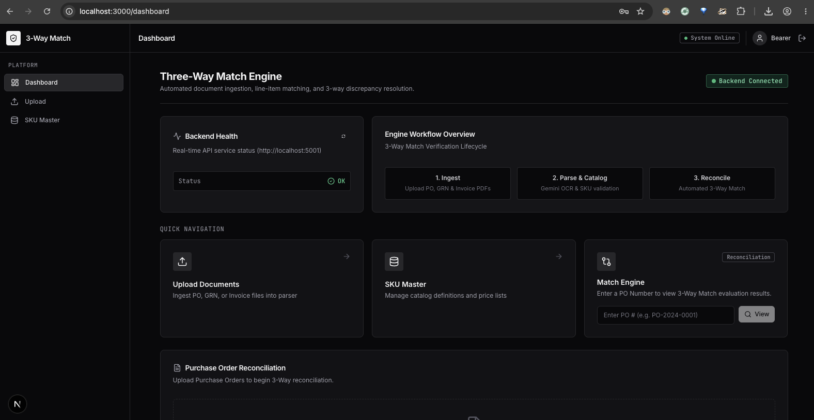
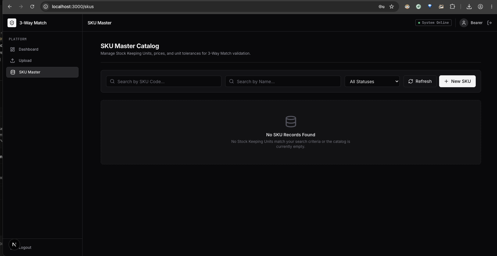
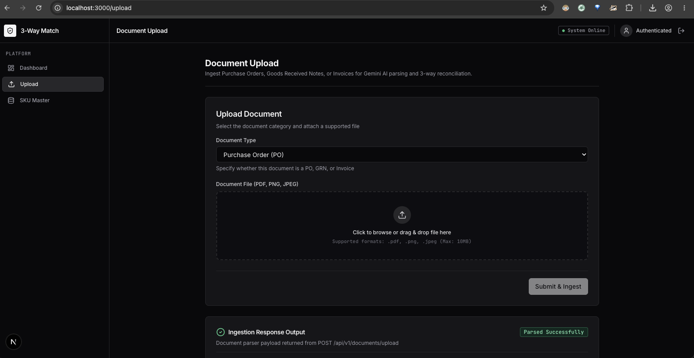
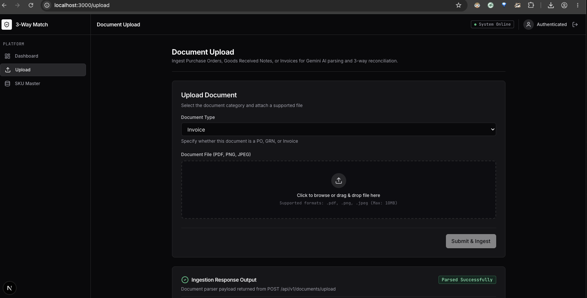
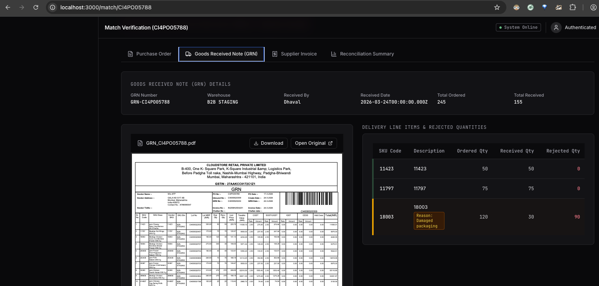
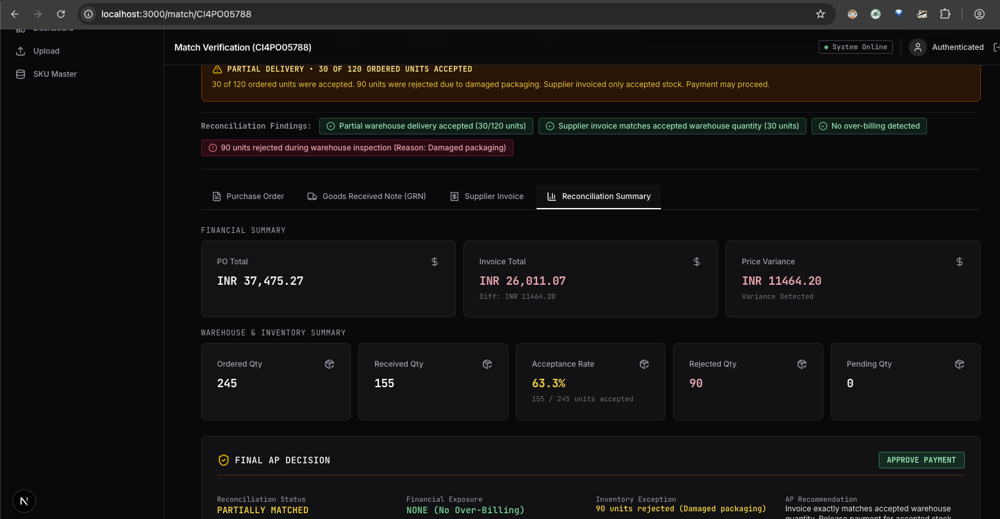
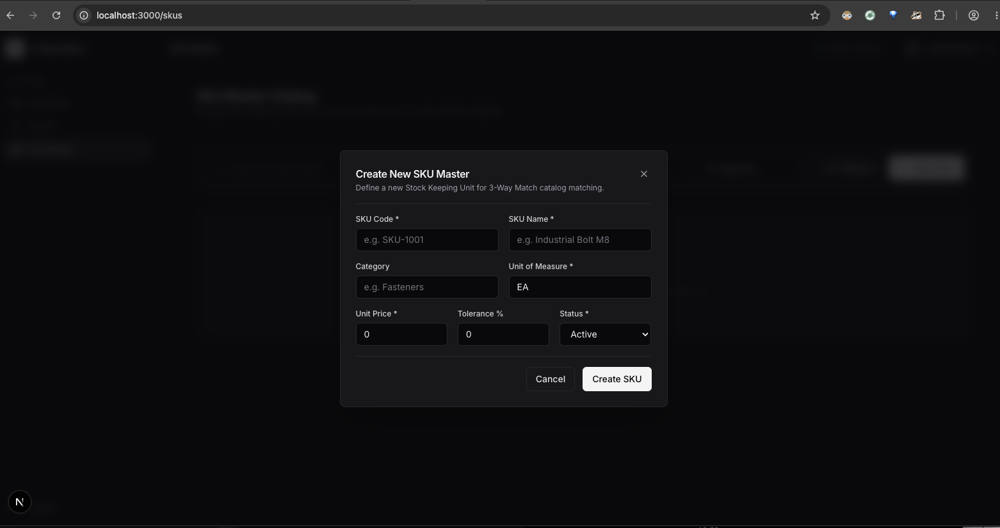

# Three-Way Match Engine for Purchase Orders (PO), Goods Received Notes (GRN), and Invoices


A production-grade, Domain-Driven Design (DDD) Three-Way Match Engine built with Node.js, Express, MongoDB, and Next.js (App Router). Automates reconciliation between Purchase Orders (PO), Goods Received Notes (GRN), and Supplier Invoices.

---

## 1. Project Overview

In enterprise procurement and accounts payable (AP), **Three-Way Matching** is a vital reconciliation control procedure that cross-references three commercial procurement documents before approving a supplier invoice for payment:

1. **Purchase Order (PO)**: Issued by the buyer specifying requested SKUs, ordered quantities, contracted unit rates, and commercial terms.
2. **Goods Received Note (GRN)**: Issued by warehouse receiving staff upon physical receipt of shipment, recording actual accepted quantities, rejected items, and inspection notes.
3. **Supplier Invoice**: Issued by the vendor requesting payment for delivered line items, unit prices, and grand totals.

### Business Problem Solved
Manual accounts payable verification is slow, expensive, and vulnerable to:
- **Overbilling**: Vendors billing for quantities greater than received or accepted.
- **Price Variances**: Unit rates exceeding contracted rates or purchase order prices.
- **Duplicate Payments**: Multiple invoices submitted for the same purchase order.
- **Unreconciled Rejections**: Paying for damaged goods rejected during warehouse dock inspection.

The **Three-Way Match Engine** automates this verification pipeline by parsing uploaded documents (via Gemini AI or Mock Parser), mapping vendor items against a canonical **SKU Master**, persisting document data, and executing a deterministic **Rule Engine** that generates item-level and PO-level reconciliation status with detailed audit findings.

---

## 2. Features

- **JWT / Static Bearer Authentication**: Environment-driven secure API protection across all endpoints.
- **Secure PDF Preview & Streaming**: Authenticated Blob Object URL streaming inside embedded frames without exposing direct media URLs.
- **Gemini AI Parser**: Live document OCR extraction via Google's Gemini REST API (`generativelanguage.googleapis.com`).
- **Mock Parser**: Offline, deterministic parser strategy for local evaluation without external AI billing dependencies.
- **SKU Master Catalogue**: Central master record management with partial unique index support (`partialFilterExpression`).
- **3-Way Matching Engine**: Recomputes item-level and PO-level reconciliation dynamically from database state.
- **Duplicate Detection**: Identifies duplicate POs (`DUPLICATE_PO`) and duplicate GRNs/Invoices (`DUPLICATE_DOCUMENT`) without blocking storage.
- **Out-of-Order Upload Support**: GRNs and Invoices can be uploaded before a Purchase Order exists; matching reconciles automatically once the PO is uploaded.
- **Embedded PDF Viewer**: Original PDF/image document preview with zoom controls (`-`, `%`, `+`) and full window opening.
- **Reconciliation Summary**: Enterprise AP summary cards, warehouse audit findings, and Final AP Decision Card (`APPROVE PAYMENT`).
- **Responsive Enterprise UI**: Sleek dark mode design system inspired by SAP Ariba with high contrast and zero horizontal clipping.

---

## 3. System Architecture



---

## 4. Folder Structure

```
three-way-match-engine/
├── src/
│   ├── config/
│   │   ├── env.js                # Frozen environment variables & validation
│   │   └── db.js                 # Mongoose connection & index configuration
│   ├── domain/                   # Domain entities (PO, GRN, Invoice, SKU, MatchResult)
│   ├── models/                   # Mongoose schemas (PurchaseOrderModel, GRNModel, InvoiceModel, SKUModel)
│   ├── repositories/             # Data access layer for MongoDB collections
│   ├── modules/
│   │   ├── auth/                 # Authentication controller & Bearer token middleware
│   │   ├── document/             # Ingestion service, ParserFactory, Mock & Gemini parsers
│   │   ├── matching/             # Rule Engine, Aggregators, Rules, ResultBuilder
│   │   ├── sku/                  # SKU Master controller, repository & SKUResolver
│   │   └── summary/              # Summary dashboard aggregator & controller
│   └── shared/
│       └── logger.js             # Singleton Winston console logger
├── scripts/
│   └── fixSkuEanIndex.js         # Standalone manual index migration script
├── doc/
│   └── screenshots/              # UI Demonstration Screenshots
├── tests/                        # Unit & integration test suites
├── .env.example
├── package.json
└── README.md
```

---

## 5. Tech Stack

| Layer | Technologies Used |
|---|---|
| **Backend Runtime** | Node.js (v18+ LTS), Express.js |
| **Database & ORM** | MongoDB, Mongoose ORM |
| **AI Parsing** | Google Gemini REST API (`generativelanguage.googleapis.com`) |
| **Frontend Framework** | Next.js 16 (App Router), React 19 |
| **State Management** | TanStack Query (React Query v5) + React Context |
| **Styling & UI** | Tailwind CSS, Lucide Icons, Enterprise Dark Mode Design System |
| **Testing** | Native Node.js Test Harness, Jest, Supertest |

---

## 6. Why TanStack Query / Redux Was Chosen

**Choice: TanStack Query (React Query v5)**

### Rationale
In an Accounts Payable & Procurement application, the **backend database is the single source of truth** for document reconciliation states. 
- **Server State vs Client State**: Document match calculations (`GET /api/v1/match/:poNumber`) and SKU catalogue records are asynchronous server states that require automatic caching, background re-validation (`refetch`), loading/error states, and cache invalidation upon document upload (`queryClient.invalidateQueries`).
- **Redux Overhead Avoided**: Redux requires significant boilerplate (actions, reducers, slices) for duplicate server state mirroring. TanStack Query handles server fetching, garbage collection, optimistic updates, and cache invalidation out-of-the-box, keeping client components lean and responsive.

---

## 7. Notes for Reviewer

> [!NOTE]  
> **Offline Evaluation Ready**: The application is configured with `USE_GEMINI=false` by default.

- **Mock Mode (Default)**: Reviewers can evaluate the complete assignment (document ingestion, SKU resolution, matching rules, partial delivery reconciliation, and UI dashboards) **without spending money or requiring an external AI API key**.
- **Live Gemini AI Parsing**: To test live Google Gemini AI OCR parsing:
  1. Set `USE_GEMINI=true` in backend `.env`.
  2. Provide `GEMINI_API_KEY=your_key` in backend `.env`.
  3. Ensure your Google AI Studio key has active API quota enabled.

---

## 8. Data Model

### SkuMaster (`skus` collection)
- `skuCode` (String, required, unique index `idx_sku_code`) — Primary vendor/ERP code.
- `name` (String) — Canonical product name.
- `eanCode` (String, optional, partial unique index `idx_sku_ean_code`) — Barcode lookup key.
- `hsnCode` (String) — Harmonized System Nomenclature code.
- `uom` (String, default `'EACH'`) — Unit of measure.
- `agreedRate` (Number) — Contracted unit price.
- `mrp` (Number) — Maximum Retail Price.
- `priceTolerance` (Number, default `0.02`) — Allowed price variance fraction (e.g. 0.02 = 2%).

### PurchaseOrder (`purchase_orders` collection)
- `poNumber` (String, required) — Purchase order reference string.
- `poDate` (Date) — Date of purchase order issuance.
- `vendorName` (String) — Vendor company name.
- `items` (Array) — Line items: `[{ itemCode, description, quantity, unitPrice, skuMaster: Ref }]`.

### GRN (`grns` collection)
- `grnNumber` (String, required) — Goods Received Note number.
- `poNumber` (String, required, link key) — Link key to PO (PO need not exist yet).
- `items` (Array) — Line items: `[{ itemCode, description, receivedQuantity, rejectedQuantity, rejectionReason, mrp, skuMaster: Ref }]`.

### Invoice (`invoices` collection)
- `invoiceNumber` (String, required) — Supplier invoice number.
- `poNumber` (String, required, link key) — Link key to PO.
- `items` (Array) — Line items: `[{ itemCode, description, quantity, unitRate, mrp, skuMaster: Ref }]`.

---

## 9. Matching Rules

| Rule Name | Class | Trigger Condition | Status Impact | Reason Code |
|---|---|---|---|---|
| **Missing Document** | `MissingDocumentRule` | PO, GRN, or Invoice is missing for `poNumber`. | `insufficient_documents` | `PO_NOT_FOUND`<br>`GRN_NOT_FOUND`<br>`INVOICE_NOT_FOUND` |
| **Duplicate PO** | `DuplicateRule` | Multiple POs uploaded with identical `poNumber`. | `MISMATCHED` | `DUPLICATE_PO` |
| **Duplicate Document** | `DuplicateRule` | Multiple GRNs or Invoices uploaded with identical numbers under same `poNumber`. | `MISMATCHED` | `DUPLICATE_DOCUMENT` |
| **GRN Quantity Exceeds PO** | `QuantityRule` | Total received quantity > ordered quantity. | `MISMATCHED` | `GRN_QTY_EXCEEDS_PO_QTY` |
| **Invoice Quantity Exceeds GRN** | `QuantityRule` | Total invoiced quantity > total received quantity. | `MISMATCHED` | `INVOICE_QTY_EXCEEDS_GRN_QTY` |
| **Invoice Quantity Exceeds PO** | `QuantityRule` | Total invoiced quantity > ordered quantity. | `MISMATCHED` | `INVOICE_QTY_EXCEEDS_PO_QTY` |
| **Price Mismatch** | `PriceRule` | Billed unit rate differs from contracted `agreedRate`. | `MISMATCHED` | `PRICE_MISMATCH` |
| **Price Tolerance** | `ToleranceRule` | Unit price variance exceeds SKU price tolerance %. | `PARTIALLY_MATCHED` | `PRICE_TOLERANCE_EXCEEDED` |
| **Unmapped SKU** | `SKUResolver` | Document item code could not be resolved to SKU Master. | `PARTIALLY_MATCHED` | `UNMAPPED_MASTER_SKU` |

---

## 10. API Endpoints

### 1. Auth Login (`POST /auth/login`)
- **Request**: `{ "username": "admin", "password": "admin" }`
- **Response** (200 OK): `{ "success": true, "data": { "token": "static-bearer-token-3way-match-engine" } }`

### 2. Upload Document (`POST /api/v1/documents/upload`)
- **Headers**: `Authorization: Bearer <TOKEN>`
- **Body**: `multipart/form-data` (`file`, `documentType`)
- **Response** (201 Created): `{ "success": true, "data": { "documentId": "...", "poNumber": "CI4PO05788" } }`

### 3. Get Document Stream (`GET /api/v1/documents/:id/file`)
- **Headers**: `Authorization: Bearer <TOKEN>`
- **Response**: Binary file stream (`application/pdf` or `image/png`).

### 4. Execute Three-Way Match (`GET /api/v1/match/:poNumber`)
- **Headers**: `Authorization: Bearer <TOKEN>`
- **Response** (200 OK): Full match JSON with status, overall totals, quantities, reasons, and items.

### 6. Production Landing Endpoint (`GET /`)
- **Public / Unauthenticated**: Verification endpoint for deployment platforms (e.g. Render).
- **Response** (200 OK):
  ```json
  {
    "application": "Three-Way Match Engine API",
    "description": "Enterprise 3-Way Purchase Order Matching Service",
    "status": "healthy",
    "environment": "production",
    "version": "1.0.0",
    "timestamp": "2026-08-01T22:05:48.000Z",
    "documentation": "/api/v1",
    "health": "/health"
  }
  ```

### 7. Health Probe Endpoint (`GET /health`)
- **Public / Unauthenticated**: Lightweight liveness probe for container orchestrators and deployment health checks.
- **Response** (200 OK):
  ```json
  {
    "status": "healthy",
    "uptime": 124.58,
    "timestamp": "2026-08-01T22:05:48.000Z"
  }
  ```

---

## 11. Environment Variables

```env
PORT=5001
NODE_ENV=development
MONGODB_URI=mongodb://localhost:27017/three-way-match-engine
JWT_SECRET=this_is_only_for_local_development
AUTH_USERNAME=admin
AUTH_PASSWORD=admin
USE_GEMINI=false
UPLOAD_DIRECTORY=uploads
GEMINI_API_KEY=
```

---

## 12. Running Locally

```bash
# 1. Install backend dependencies
npm install

# 2. Configure environment
cp .env.example .env

# 3. Start development server
npm run dev

# 4. Run test suite
node tests/unit/SKUCreationFlow.test.js
node tests/unit/QuantityRule.test.js
node tests/integration/FullApiSuite.test.js
npx jest tests/integration/AuthApi.test.js
```

---

## 13. UI Screenshots & Flow Walkthrough

---

### Login

Authentication screen using static Bearer authentication (`AUTH_USERNAME` / `AUTH_PASSWORD`).



---

### Dashboard

Main enterprise accounts payable reconciliation dashboard overview.


---

### Upload Documents

Document upload modal allowing users to select PDF/image files tagged as Purchase Order, Goods Received Note, or Supplier Invoice.



---

### Upload Progress

Real-time upload progress and document parsing indicator.


---

### SKU Master

Central SKU Master catalogue management screen listing canonical vendor item codes, barcode EANs, contracted agreed rates, and price tolerance bands.


---

### Create SKU

Modal interface for creating new master SKU items with validation for unique ERP codes and barcode EANs.



---

### Purchase Order

Purchase Order detail view displaying left-hand form details, right-hand authenticated PDF preview, and line item grid showing `ORDERED` status.



---

### Goods Received Note

Goods Received Note (GRN) detail view displaying warehouse dock receiving quantities, accepted stock, and dock rejection inspection notes (`Damaged packaging`).


---

### Supplier Invoice

Supplier Invoice detail view showing billed line items, unit rates, and invoice PDF preview.



---

### Match Summary

Reconciliation summary dashboard displaying financial totals, warehouse inventory metrics, document status badges, and enterprise audit cards.


---

### Partial Match Audit

Detailed partial delivery reconciliation view surfacing accepted warehouse stock vs billed stock without false overbilling alerts.


---

### PDF Viewer Controls

Embedded PDF viewer toolbar featuring zoom controls (`-`, `%`, `+`), filename display, and direct download actions.


---

### PDF Viewer Fullscreen

Expanded original document preview mode.



---

### Master Resolution

Line item grid highlighting resolved master SKU codes (`SkuMaster._id`) and canonical item names across linked procurement documents.


---

### Final AP Decision Card

Compact Accounts Payable decision card displaying status (`PARTIALLY MATCHED`), financial exposure (`NONE`), and recommendation (`APPROVE PAYMENT`).



---

### Warehouse Audit Cards

Enterprise audit finding cards detailing verified supplier billing, accepted partial deliveries, and dock rejection notes.


---

### Responsive Layout

Sleek, responsive dark mode enterprise UI layout adapting seamlessly to high-density desktop displays.



---

## 14. License

MIT License. Free for evaluation and commercial use.
